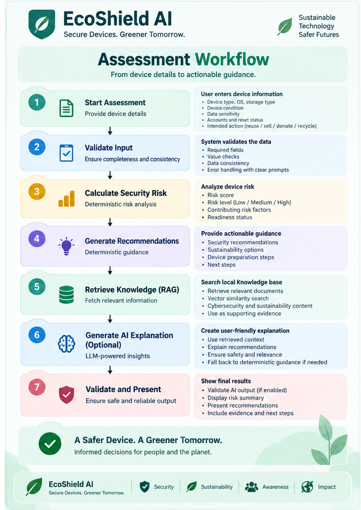
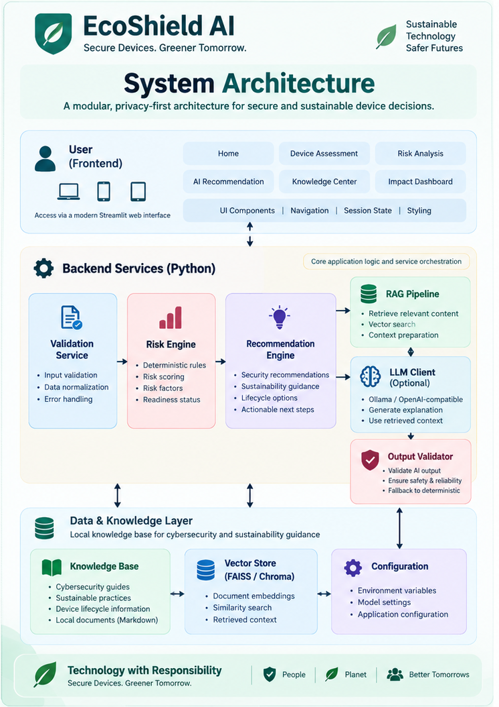
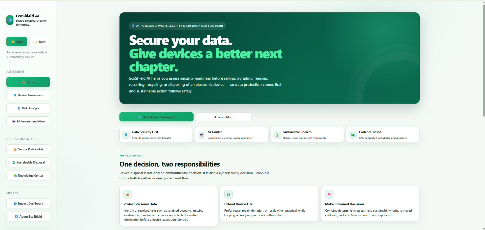
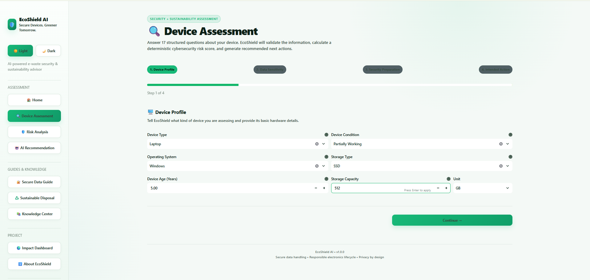
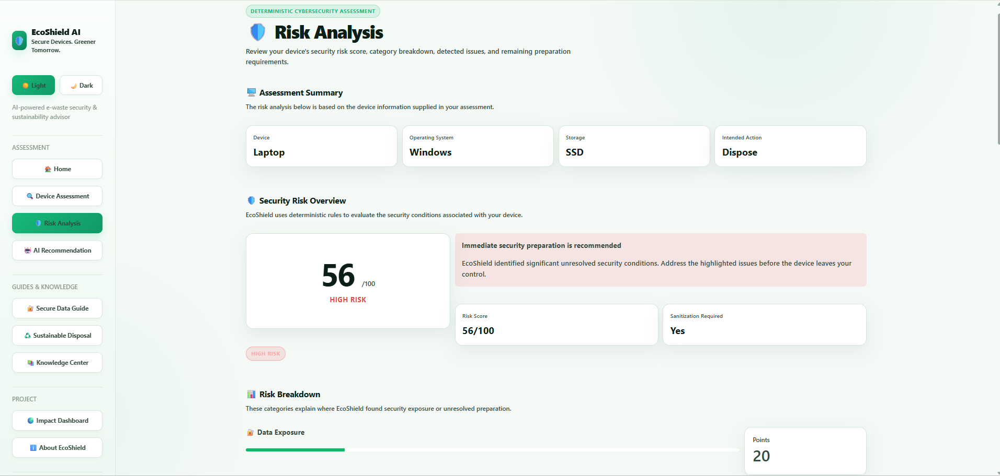
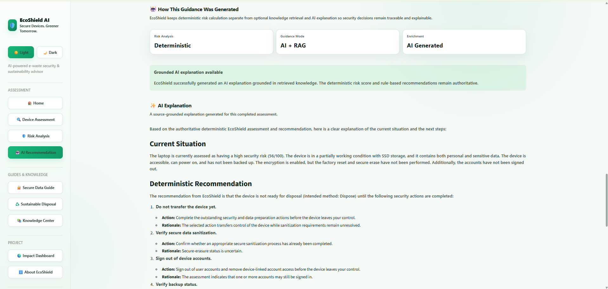
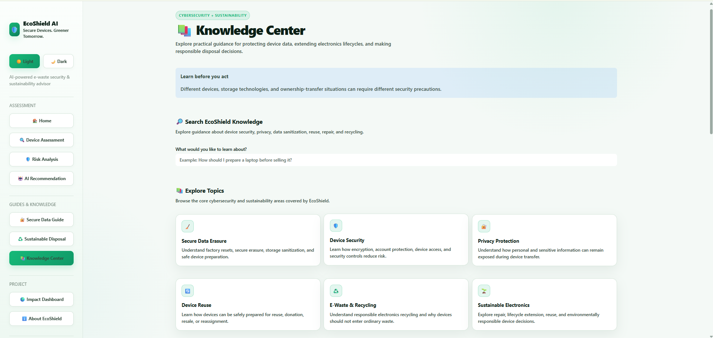
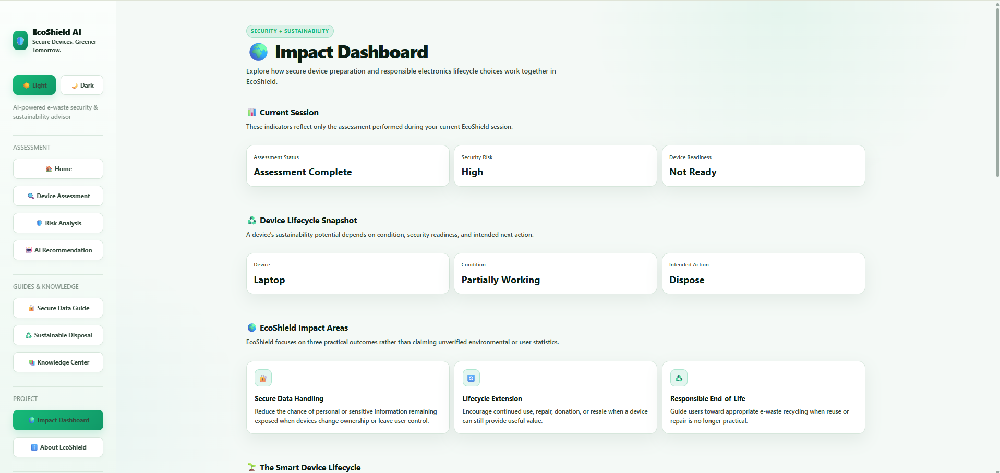

# EcoShield AI

> A privacy-first cybersecurity and sustainability advisor that helps users assess electronic devices before reuse, resale, donation, repair, or recycling.

## Live Demo

[](https://ecoshield-ai.streamlit.app)

---

## Project Overview

**EcoShield AI** is an AI-assisted e-waste security and sustainability advisory system designed to help users make safer decisions before transferring or disposing of electronic devices.

Electronic devices may continue to contain personal data, sensitive files, logged-in accounts, removable media, and recoverable information even when they are being sold, donated, repaired, reused, or recycled. At the same time, unnecessarily discarding usable devices contributes to electronic waste.

EcoShield AI addresses both concerns through a structured device assessment, deterministic cybersecurity risk analysis, sustainability guidance, Retrieval-Augmented Generation (RAG), and optional LLM-generated explanations. The deterministic assessment remains the authoritative source of risk and recommendation decisions, while AI is used only as an explanatory layer.

---

## Problem Statement

When users decide to sell, donate, repair, reuse, or recycle an electronic device, they often focus on the physical condition of the device but overlook the security of the data stored on it.

Common problems include:

- personal or sensitive information remaining on the device
- accounts remaining signed in
- incomplete backups
- removable storage being forgotten
- factory reset or secure erase not being performed
- confusion about the difference between deletion, reset, and secure sanitization
- uncertainty about whether a device is ready for transfer
- discarding devices that could still be reused or repaired
- lack of clear guidance connecting cybersecurity with sustainable device disposal

Traditional advice is often fragmented across multiple sources and may not consider the actual condition, storage type, security preparation, and intended lifecycle action of a particular device.

A structured technical system can help users evaluate these factors together and provide consistent security and sustainability guidance.

---

## Proposed Solution

EcoShield AI provides a guided device assessment that collects information about the device, its data sensitivity, security preparation, condition, and intended next action.

The system then:

1. validates the assessment data
2. calculates a deterministic cybersecurity risk score
3. identifies contributing risk factors
4. determines transfer/disposal readiness
5. generates deterministic recommendations
6. evaluates suitable lifecycle options
7. retrieves relevant knowledge from a curated local knowledge base
8. optionally generates an AI explanation using retrieved evidence
9. validates AI-generated output before presenting it
10. falls back safely to deterministic guidance if AI output cannot be trusted

This approach keeps the core decision process transparent and predictable while still allowing AI to improve explanation and usability.

---

## Objectives

The main objectives of EcoShield AI are to:

- assess device security before reuse, transfer, repair, or disposal
- identify important data-security and privacy risks
- provide consistent deterministic risk scoring
- generate actionable security recommendations
- encourage reuse, repair, donation, resale, and responsible recycling
- retrieve relevant cybersecurity and sustainability guidance
- provide optional grounded AI explanations
- prevent AI-generated content from overriding deterministic security decisions
- protect user privacy through a session-based, no-account workflow
- provide clear educational guidance for responsible e-waste handling

---

## Key Features

### Device Assessment

Collects structured information about:

- device type
- operating system
- storage type
- device condition
- accessibility
- personal and sensitive data
- encryption status
- backup status
- removable media
- account sign-out
- secure erase
- factory reset
- intended device action

### Deterministic Risk Analysis

EcoShield uses predefined rules to calculate device security risk.

Outputs include:

- risk score
- risk level
- detected security factors
- category-level risk information
- readiness status

The deterministic engine remains authoritative even when RAG or AI mode is enabled.

### Deterministic Recommendation Engine

Recommendations are generated directly from detected assessment conditions and can cover:

- security
- privacy
- data protection
- account security
- device preparation
- sustainability
- disposal
- uncertainty handling

### RAG Knowledge Retrieval

EcoShield retrieves relevant information from a curated local knowledge base covering cybersecurity and sustainable device-lifecycle topics.

### AI-Assisted Recommendation Explanation

When AI mode is enabled, EcoShield can generate a user-friendly explanation grounded in:

- deterministic risk results
- deterministic recommendations
- retrieved RAG evidence

The AI layer does not recalculate the risk score.

### Guarded AI Output

Generated AI responses are validated before presentation. Unsupported actions, URLs, risk outcomes, or unverified claims can trigger safe fallback.

### Secure Data Guide

Provides educational guidance related to:

- backups
- account sign-out
- removable storage
- secure data erasure
- factory reset
- encryption
- secure device transfer

### Sustainable Disposal Guidance

EcoShield encourages a lifecycle-first decision process:

1. Reuse
2. Repair
3. Donate
4. Resell
5. Responsible Recycling

### Knowledge Center

Provides searchable cybersecurity and sustainability guidance and an optional guarded **Ask EcoShield AI** feature.

### Impact Dashboard

Displays current-session information about:

- assessment completion
- risk level
- readiness
- lifecycle condition
- sustainable next-action guidance

The dashboard does not fabricate global environmental or user-impact statistics.

### Light and Dark Themes

The Streamlit interface supports polished Light and Dark visual modes with a consistent cybersecurity and sustainability design system.

---

## How the Project Works



### Workflow Stages

**1. User Assessment**  
The user answers structured questions about the device and its current security state.

**2. Validation**  
Assessment values are checked before downstream processing.

**3. Risk Analysis**  
The deterministic risk engine evaluates security conditions and produces the risk score and level.

**4. Recommendation Generation**  
Detected factors are converted into prioritized deterministic actions.

**5. Sustainability Evaluation**  
Device condition and lifecycle context are used to provide reuse, repair, donation, resale, or recycling guidance.

**6. RAG Retrieval**  
Relevant knowledge documents are retrieved from the local knowledge base.

**7. Optional AI Explanation**  
When AI mode is enabled, retrieved evidence and deterministic results are supplied to the LLM.

**8. AI Safety Validation**  
Generated content is checked before presentation.

**9. Final Output**  
The user receives grounded AI guidance or safe deterministic fallback.

---

## System Architecture



> **Architectural principle:** The deterministic risk and recommendation engines are authoritative. RAG and AI may enrich explanations but must not override deterministic security decisions.

---

## Technology Stack

| Category | Technology |
|---|---|
| Programming Language | Python 3.12 |
| Frontend | Streamlit 1.60.0 |
| Configuration | python-dotenv |
| HTTP Communication | requests |
| Retrieval / ML Utilities | scikit-learn |
| Testing | pytest |
| Local LLM Runtime | Ollama |
| Tested Local Model | Qwen 2.5 3B |
| Knowledge Retrieval | Local RAG pipeline |
| Knowledge Source | Curated Markdown files |
| Storage | No persistent user database |

---

## Project Structure

```text
EcoShieldAI/
├── app.py
├── README.md
├── requirements.txt
├── .env.example
├── .gitignore
│
├── .streamlit/
│   └── config.toml
│
├── config/
│   └── config.py
│
├── knowledge_base/
│   ├── cybersecurity/
│   └── sustainability/
│
├── src/
│   ├── recommendation.py
│   ├── risk_engine.py
│   ├── sustainability_engine.py
│   ├── validators.py
│   │
│   ├── ai/
│   │   ├── llm_client.py
│   │   └── recommendation_enricher.py
│   │
│   ├── rag/
│   │   ├── document_loader.py
│   │   ├── retriever.py
│   │   └── vector_store.py
│   │
│   └── services/
│       ├── advisor_service.py
│       ├── assessment_service.py
│       ├── frontend_integration.py
│       └── __init__.py
│
├── ui/
│   ├── components.py
│   ├── navigation.py
│   ├── state.py
│   └── styles.py
│
├── views/
│   ├── home.py
│   ├── assessment.py
│   ├── risk_analysis.py
│   ├── ai_recommendation.py
│   ├── secure_data_guide.py
│   ├── sustainable_disposal.py
│   ├── knowledge_center.py
│   ├── impact_dashboard.py
│   └── about.py
│
├── tests/
│   ├── test_advisor.py
│   ├── test_assessment_service.py
│   ├── test_config.py
│   ├── test_frontend_integration.py
│   ├── test_recommendation.py
│   ├── test_risk_engine.py
│   ├── test_state.py
│   ├── test_sustainability_engine.py
│   └── test_validation.py
│
└── docs/
    ├── diagrams/
    └── screenshots/
```

### Important Directories

- `src/` — core processing and service logic
- `src/rag/` — knowledge loading, retrieval, and vector-search logic
- `src/ai/` — LLM integration and recommendation enrichment
- `knowledge_base/` — curated cybersecurity and sustainability guidance
- `views/` — Streamlit application pages
- `ui/` — shared visual components, navigation, styling, and state handling
- `tests/` — automated test suite
- `config/` — runtime configuration
- `docs/` — screenshots and diagrams

---

## Core Logic

### Validation Engine

Checks and normalizes assessment inputs before downstream processing.

### Risk Engine

Evaluates predefined security conditions such as:

- personal and sensitive data
- encryption
- secure erase
- factory reset
- account sign-out
- backup status
- removable media
- storage uncertainty
- device accessibility

It produces an explainable deterministic risk score, level, and factor set.

### Recommendation Engine

Maps detected factors to prioritized security, privacy, data-protection, device-preparation, sustainability, disposal, and uncertainty-handling actions.

### Sustainability Engine

Uses device condition and lifecycle context to provide reuse, repair, donation, resale, or recycling guidance.

### RAG Pipeline

The RAG pipeline contains:

- `document_loader.py` — loads curated knowledge documents
- `vector_store.py` — creates searchable document representations
- `retriever.py` — retrieves relevant guidance

### AI Enrichment

Uses deterministic results and retrieved evidence to generate optional natural-language explanations.

### AI Validation and Safe Fallback

Generated content is validated for issues such as:

- unsupported device-specific actions
- unsupported URLs
- unsupported risk outcomes
- unverified completion claims
- prompt leakage
- invalid response length
- grounding problems

Unsafe or unsupported output is replaced by safe deterministic fallback.

---

## Security and Privacy

Implemented measures include:

- no account registration required
- no persistent user database for the assessment flow
- environment variables for runtime configuration
- `.env` excluded from source control
- `.env.example` contains only safe example values
- assessment input validation
- deterministic logic remains authoritative
- AI output is validated before presentation
- unsupported AI actions and URLs can be rejected
- retrieved evidence is used for grounding

EcoShield is an educational and decision-support tool and does not physically verify real-device sanitization.

---

## Installation and Setup

### Prerequisites

- Python 3.12
- pip
- Git
- Optional: Ollama for local AI mode

### Clone the Repository

```bash
git clone https://github.com/roopaswathikaponnada/EcoShieldAI.git
cd EcoShieldAI
```

### Create a Virtual Environment

#### Windows PowerShell

```powershell
python -m venv .venv
.venv\Scripts\Activate.ps1
```

#### macOS / Linux

```bash
python3 -m venv .venv
source .venv/bin/activate
```

### Install Dependencies

```bash
pip install -r requirements.txt
```

---

## Environment Configuration

Copy `.env.example` to `.env`.

Safe default:

```env
APP_ENV=development
ASSESSMENT_MODE=deterministic
```

Supported modes:

```env
ASSESSMENT_MODE=deterministic
ASSESSMENT_MODE=rag
ASSESSMENT_MODE=ai
```

---

## Assessment Modes

### Deterministic Mode

```env
ASSESSMENT_MODE=deterministic
```

Runs validation, deterministic risk analysis, recommendations, and sustainability guidance. No LLM is required.

### RAG Mode

```env
ASSESSMENT_MODE=rag
```

Adds retrieved knowledge evidence to the deterministic result.

### AI Mode

```env
ASSESSMENT_MODE=ai
```

Runs deterministic assessment, RAG retrieval, LLM explanation, safety validation, and safe fallback when required.

---

## Optional Local AI Setup

EcoShield was tested with **Ollama** and **Qwen 2.5 3B**.

```bash
ollama pull qwen2.5:3b
```

Example `.env` configuration:

```env
ASSESSMENT_MODE=ai
LLM_PROVIDER=ollama
LLM_MODEL=qwen2.5:3b
LLM_BASE_URL=http://localhost:11434
LLM_API_KEY=
LLM_TEMPERATURE=0.2
LLM_MAX_OUTPUT_TOKENS=600
LLM_TIMEOUT_SECONDS=300
```

Make sure Ollama is running before using AI mode.

---

## Running the Application

```bash
streamlit run app.py
```

---

## Usage

1. Launch EcoShield AI.
2. Open **Device Assessment**.
3. Enter the device profile and security details.
4. Submit the assessment.
5. Review **Risk Analysis**.
6. Review the generated recommendations.
7. If RAG or AI mode is enabled, inspect grounded guidance.
8. Use **Secure Data Guide** for additional security education.
9. Review **Sustainable Disposal** options.
10. Use the **Knowledge Center** for educational guidance.
11. Review the **Impact Dashboard** for current-session lifecycle information.

---

## Example Workflow

Consider a user planning to sell a laptop.

### Input

The user reports that:

- the device is a laptop
- personal data is present
- storage type is known
- some security preparation is incomplete
- the intended action is resale

### Processing

```text
Assessment
   ↓
Validation
   ↓
Risk-factor detection
   ↓
Deterministic risk score
   ↓
Security recommendations
   ↓
Lifecycle guidance
   ↓
Optional RAG retrieval
   ↓
Optional grounded AI explanation
```

### Output

EcoShield presents:

- risk score
- risk level
- readiness status
- detected concerns
- prioritized security recommendations
- sustainable lifecycle guidance
- optional retrieved evidence
- optional validated AI explanation

The exact result depends on the assessment answers.

---

## Knowledge Base

### Cybersecurity Knowledge

Current topics include:

- account and identity security
- encryption and data protection
- factory reset and sanitization
- platform security guidance
- removable media security
- secure data erasure
- secure device transfer
- storage media sanitization

### Sustainability Knowledge

Current topics include:

- device repair
- device reuse
- donation and resale
- e-waste awareness
- responsible recycling
- sustainable device lifecycle

---

## Application Screenshots

### Home

EcoShield AI introduces a security-first approach to responsible electronics reuse and disposal.



### Device Assessment

The structured assessment collects device, storage, data-sensitivity, security-preparation, and lifecycle information.



### Risk Analysis

The deterministic risk engine evaluates the completed assessment and presents the security score, risk level, readiness, and contributing factors.



### AI Recommendation

In AI mode, deterministic recommendations are enriched using retrieved RAG evidence while the deterministic result remains authoritative.



### Knowledge Center

The Knowledge Center provides curated cybersecurity and sustainability guidance with searchable topics.



### Impact Dashboard

The Impact Dashboard summarizes current-session security readiness and sustainable device-lifecycle information.



## Testing

Run:

```bash
python -m pytest -q
```

Latest completed test run:

```text
500 passed in 7.02s
```

The project was also manually tested through the full Streamlit workflow in Light and Dark modes.

---

## Error Handling

Implemented handling includes:

- invalid assessment input
- AI configuration problems
- LLM request failures
- LLM timeouts
- unsupported generated content
- unsafe or unsupported generated actions
- unsupported URLs
- validation failures
- RAG/AI enrichment failures

Optional AI failures do not replace or invalidate the deterministic assessment.

---

## Challenges Faced

### Maintaining Deterministic Authority

AI integration was designed so the LLM could explain results without changing authoritative security decisions.

### Grounding AI Responses

RAG evidence, prompt constraints, post-generation validation, and safe fallback were used to reduce unsupported guidance.

### Local LLM Performance

Configurable timeout and token settings were used to support slower local generation.

### Streamlit Runtime Behavior

Streamlit configuration was adjusted to avoid development-time file-watcher issues during AI/RAG integration.

### UI Consistency

A centralized styling system maintains consistent components, Light/Dark themes, and responsive behavior.

---

## What I Learned

The project provided practical experience in:

- modular Python architecture
- Streamlit application development
- deterministic rule systems
- cybersecurity risk analysis
- recommendation engines
- Retrieval-Augmented Generation
- local LLM integration
- prompt design and grounding
- AI output validation
- safe fallback design
- privacy-conscious software design
- sustainability concepts
- automated testing
- debugging and integration
- Git/GitHub preparation

---

## Limitations

- cannot physically verify secure erase or factory reset
- does not replace professional forensic sanitization
- local AI performance depends on hardware
- AI output may be rejected by safety validation
- no persistent long-term impact analytics
- no verified recycler-location integration
- lifecycle guidance is not an environmental certification
- cannot guarantee unrecoverability of deleted data from physical storage

---

## Future Enhancements

Possible future improvements include:

- larger curated knowledge bases
- improved semantic retrieval and reranking
- stronger semantic validation
- additional LLM provider integrations
- device-specific sanitization workflows
- manufacturer-specific guidance
- verified recycler integrations
- consent-based sustainability analytics
- accessibility improvements
- richer lifecycle-impact calculations
- organizational deployment support
- reporting and export options

---

## Internship Project

EcoShield AI was developed as part of an **AI for Sustainability internship project** combining:

- Artificial Intelligence
- Retrieval-Augmented Generation
- Large Language Models
- Cybersecurity
- Privacy
- Sustainable Electronics
- E-Waste Awareness

---

## Design Principles

- **Security First**
- **Deterministic Before Generative**
- **Grounded AI**
- **Safe Failure**
- **Privacy by Design**
- **Sustainability After Security**
- **Transparency**

---

## Repository Security

The repository `.gitignore` excludes sensitive and generated files such as:

```text
.env
.venv/
__pycache__/
.pytest_cache/
.vscode/
*.log
```

Safe configuration examples are stored in `.env.example`.

---

## Author

**Roopa Swathika**

B.Tech — Cyber Security

GitHub: [github.com/roopaswathikaponnada](https://github.com/roopaswathikaponnada)

LinkedIn: [linkedin.com/in/roopa-swathika-ponnada-4b3844395](https://www.linkedin.com/in/roopa-swathika-ponnada-4b3844395/)

---

## Repository

Repository URL: [github.com/roopaswathikaponnada/EcoShieldAI](https://github.com/roopaswathikaponnada/EcoShieldAI)

---

## Acknowledgements

This project uses open-source technologies including:

- Python
- Streamlit
- pytest
- scikit-learn
- python-dotenv
- requests
- Ollama

---

## License

> Licensing information has not yet been specified.
